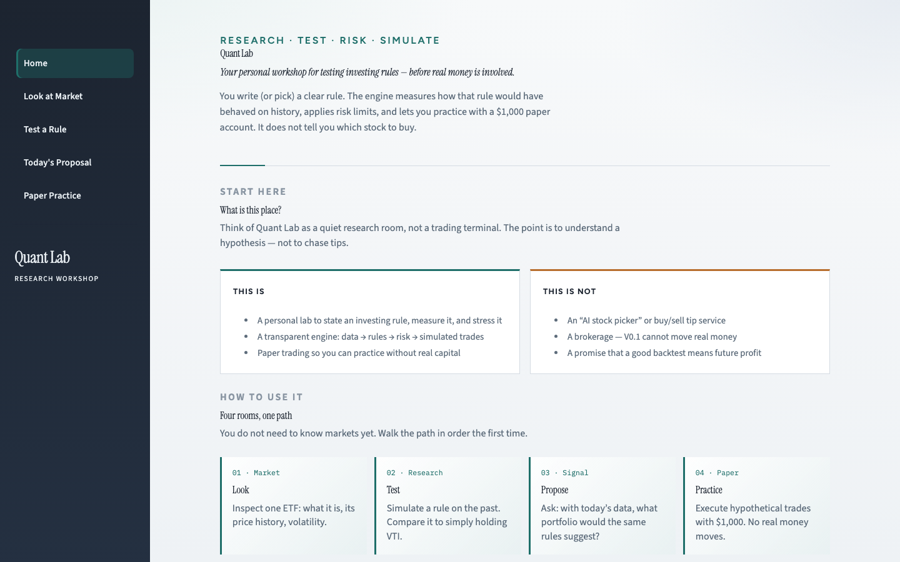

# Quant Lab

A personal quantitative research and paper-trading system.

Quant Lab is not a stock picker and not a brokerage. It is a small, owned engine for stating a hypothesis, measuring it on historical data, applying risk constraints, and simulating execution. Version 0.1 is research plus paper trading only. It is designed so that a later live broker can be added without rewriting strategies, the backtester, portfolio construction, or the risk engine.

The user is assumed to be comfortable with mathematics and Python, and new to markets. The engine is therefore strict about time, data quality, and explainability. The UI is a thin view over that engine.

This is not investment advice. A backtest is not evidence of future profitability. Do not treat any path in this repository as a recommendation to buy or sell.



## Docs

| Doc | Contents |
| --- | --- |
| [`docs/ARCHITECTURE.md`](docs/ARCHITECTURE.md) | System map and extension points |
| [`docs/CASE_NOTE.md`](docs/CASE_NOTE.md) | Sample study: Momentum + Trend vs VTI |
| [`docs/DEPLOY.md`](docs/DEPLOY.md) | Streamlit Community Cloud |
| [`docs/images/`](docs/images/) | Screenshots and diagram |

**Repository:** https://github.com/caalopezgo/quantlab

## What V0.1 is

- A modular quantitative engine: data → features → strategy → portfolio construction → risk → target positions → broker interface
- A transparent daily backtester we own (no third-party backtesting framework)
- Two strategies: Buy & Hold (default benchmark **VTI**) and Momentum + Trend
- A risk engine that can override a strategy
- A `PaperBroker` with SQLite persistence and a $1,000 experimental bankroll
- A Streamlit UI that contains **no** financial logic

## What V0.1 is not

- Not an AI stock picker
- Not connected to Schwab, Alpaca, IB, or any live broker
- Not a parameter optimizer (no grid search, no “best Sharpe”)
- Not a real-time quote system
- Not licensed to send real-money orders

## Architecture

```
DATA → FEATURES → STRATEGY → PORTFOLIO CONSTRUCTION → RISK ENGINE
    → SIGNALS / TARGET POSITIONS → BROKER INTERFACE
    → PAPER EXECUTION NOW
    → REAL BROKER EXECUTION LATER

UI → SERVICE LAYER → QUANT ENGINE
```

Full diagram and module map: [`docs/ARCHITECTURE.md`](docs/ARCHITECTURE.md).

Responsibilities are exclusive:

| Layer | Decides | Must not |
| --- | --- | --- |
| Strategy | Which assets look attractive, and a raw score | Execute, download vendor data, know about brokers |
| Portfolio construction | How much of each selected asset | Talk to a broker |
| Risk engine | Whether the proposed book is allowed; may resize | Invent signals |
| Broker | Accept/reject/fill already-validated orders | Choose what to buy |
| UI | Display and collect inputs | Contain valuation, sizing, or trading rules |

Replacing Streamlit with another client should not require changes inside `quantlab/strategies`, `quantlab/backtest`, `quantlab/risk`, or `quantlab/brokers/base.py`.

### Data flow

1. `MarketDataProvider.get_history` returns per-ticker OHLCV.
2. Validation rejects NaNs, non-monotonic dates, duplicates, non-positive prices, and inconsistent bars. Missing prints are **not** filled.
3. An inner-joined panel is the research calendar. We do not fabricate a price for a name that did not trade.
4. Features are pure functions of that panel.

V0.1 implements `YahooFinanceProvider`. A future `SchwabDataProvider` or `PolygonDataProvider` implements the same interface. Strategies never import `yfinance`.

**Price series used for research:** Yahoo daily bars with `auto_adjust=True`. Open/high/low/close are split- and dividend-adjusted and are appropriate for total-return work. Signals use **close**. Simulated fills use the **next session open**. Paper fills use the **latest available close**, which is not a live quote.

### Time semantics and look-ahead

A signal dated T is computed from information available at the close of T.

That signal is not tradable on T. The backtester executes at the **next session’s open**. A position decided at T earns none of T’s close-to-close return.

Strategies do not shift their own signals. The engine does. Tests in `tests/test_lookahead.py` prove:

- a jump visible at close T cannot be earned on T
- changing prices after T cannot change the signal at T
- fills occur on a later session than their generating signal

If those tests fail, V0.1 is considered failed.

### Strategy flow

`BuyAndHoldStrategy` allocates to a configured benchmark (default VTI) once.

`MomentumTrendStrategy` (monthly, last session of the month):

1. Eligible if close > N-day SMA (default N = 200)
2. Eligible if trailing total return over M sessions is positive (default M = 126)
3. Rank eligible names by momentum; take the top K (default K = 2)
4. Equal-weight the selected names
5. If none qualify, allocate to the configured safe asset (SHY) or cash

Universe membership lives in `config/default.yaml`, not inside strategy code.

### Risk flow

```
proposed weights → RiskEngine.review → approved weights + cash + explanations
```

V0.1 limits: max gross exposure 90%, cash buffer 10%, max weight per asset 50%, max positions, no leverage, no shorting. Leftover after clips is cash, not redistributed. The architecture can later host volatility targeting, drawdown controls, VaR/CVaR, Kelly, correlation/sector limits, daily loss limits, and a kill switch without changing the strategy contract.

Buy & Hold **as benchmark** is fully invested and is not passed through those overlays, so a return gap can include cash drag. That is intentional and disclosed.

### Broker abstraction

```python
class Broker:
    get_account(); get_positions()
    submit_order(); cancel_order()
    get_orders(); get_fills()
```

`PaperBroker` is the only implementation. A future `SchwabBroker` implements the same methods. The live path must remain:

```
strategy → portfolio construction → risk engine → proposed orders → validation → broker
```

and later:

```
broker state → reconciliation → local portfolio state
```

Never `strategy → broker`.

V0.1 does not authenticate to any broker and does not read brokerage secrets.

### Future AI / LLM integration

`AlternativeSignalProvider` is a stub. The engine runs with no AI.

A future model may emit **dated numeric features** (sentiment scores, event flags, filing-derived values). Those features can be backtested. An LLM saying “buy Nvidia” must never become an order.

## Installation

Python 3.11+ is required.

```bash
cd quantlab
python3 -m venv .venv
source .venv/bin/activate
pip install -e ".[dev]"
# or: pip install -r requirements.txt && pip install pytest
```

Copy `.env.example` to `.env` if you want to override paths. No API keys are required for V0.1.

## Tests

```bash
pytest
```

Tests use deterministic synthetic data and do not need Yahoo. The look-ahead suite is mandatory. CI runs the same suite on every push (`.github/workflows/ci.yml`).

## Run the UI

```bash
streamlit run app.py
```

Rooms: **Home** · **Look at Market** · **Test a Rule** · **Today's Proposal** · **Paper Practice**.

## First experiment

Historically, with $10,000:

```bash
python scripts/sample_backtest.py
```

Then open **Today's Proposal** and generate a book for a hypothetical $1,000. Creating paper orders requires confirmation. Restarting the app keeps local SQLite paper history.

Write-up of the study: [`docs/CASE_NOTE.md`](docs/CASE_NOTE.md).

## Configuration

`config/default.yaml` holds the universe, lookbacks, risk caps, paper bankroll, costs, and development/validation dates. Important assumptions are not hidden in code.

Starter universe:

| Ticker | Role |
| --- | --- |
| VTI | Broad US equity market (benchmark) |
| QQQ | Large Nasdaq-listed growth / technology-heavy companies |
| IWM | US small-cap equities |
| EFA | Developed international equities |
| EEM | Emerging-market equities |
| TLT | Long-duration US Treasury bonds |
| GLD | Gold exposure |
| SHY | Short-duration US Treasuries (safe asset) |

## Data-source limitations

Yahoo Finance is delayed, vendor-adjusted, and can change historical prints. Cached files make two runs on the same cache identical; two downloads on different days may not be. Yahoo is not a production market-data feed. Gaps are not interpolated.

## Paper trading

Default bankroll: **$1,000**. That is the experimental capital, not a thinkorswim-style virtual $200,000.

State lives in `data/quantlab.db`. Reset requires a confirmation checkbox.

No leverage, no shorting, no options. The paper broker rejects impossible orders.

## Roadmap

**V0.1** — Quant core, backtesting, risk, signals, paper broker, basic UI.

**V0.2** — Better market data, portfolio analytics, additional strategies, walk-forward analysis, ensembles.

**V0.3** — Alternative data, news, fundamentals, LLM-derived structured signals, ML strategies.

**V0.4** — Schwab (or other) market-data integration, broker synchronization, paper execution through a broker API.

**V0.5+** — Controlled real-money execution, reconciliation, advanced risk limits, monitoring, alerts, kill switch.

None of V0.2+ is implemented here.

## Intellectual stance

The goal is: discover a hypothesis, quantify it, test it, measure risk, simulate it, and only then consider capital. AI can later help with hypothesis generation and unstructured extraction. AI output still has to survive the same quantitative pipeline.
