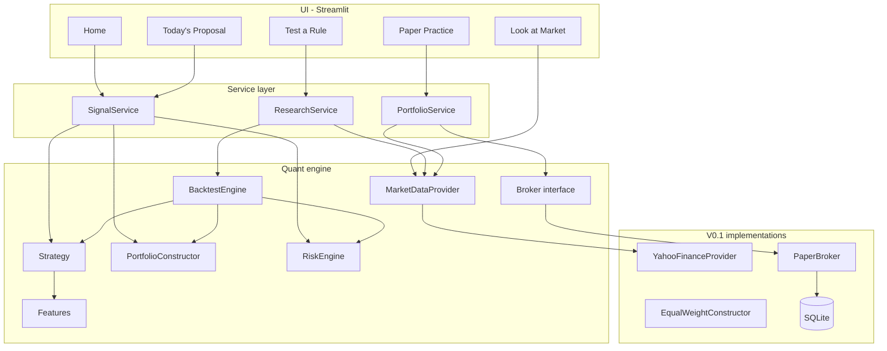

# Architecture — Quant Lab V0.1

One-page map of the system for hiring managers and collaborators.

## Principle

```
DATA → FEATURES → STRATEGY → PORTFOLIO CONSTRUCTION → RISK ENGINE
    → TARGET POSITIONS → BROKER INTERFACE → PAPER (now) / LIVE (later)

UI → SERVICE LAYER → QUANT ENGINE
```

The UI never contains financial logic.  
Strategies never execute.  
Brokers never choose what to buy.  
Risk can override a strategy.

## Diagram



## Module map

| Package | Responsibility |
| --- | --- |
| `quantlab/domain` | Typed models, enums, time semantics, errors |
| `quantlab/data` | Provider interface, Yahoo, cache, validation, universe |
| `quantlab/features` | Pure feature math (returns, SMA, momentum, vol) |
| `quantlab/strategies` | Intent only: Buy & Hold, Momentum + Trend |
| `quantlab/portfolio` | Equal-weight construction, ledger accounting |
| `quantlab/risk` | Review / resize / explain |
| `quantlab/backtest` | Owned event loop, next-open fills, metrics, sanity |
| `quantlab/brokers` | `Broker` ABC + `PaperBroker` |
| `quantlab/storage` | SQLite schema + repositories |
| `quantlab/services` | App workflows for the UI |
| `pages/` + `app.py` | View/control only |

## Time contract (non-negotiable)

1. Signal at close of session **T** uses information through T only.  
2. Earliest fill is the **next session open**.  
3. A position decided at T earns **none** of T’s close-to-close return.  
4. Enforced in `BacktestEngine`; proven in `tests/test_lookahead.py`.

## Extension points (no rewrite)

| Replace | With | Untouched |
| --- | --- | --- |
| `YahooFinanceProvider` | Polygon / Schwab / IB data | strategies, risk, backtester |
| `PaperBroker` | `SchwabBroker` (future) | strategies, construction, risk |
| Streamlit | Next.js / desktop | entire `quantlab/` engine |

Future live path must remain:

```
strategy → construction → risk → proposed orders → validation → broker
broker state → reconciliation → local state
```

Never `strategy → broker`.

## Data quality

Validation rejects: empty frames, NaNs, duplicate dates, non-monotonic index, non-positive prices, inconsistent OHLC.  
Missing prices are **not** forward-filled. Research calendar is an **inner join**.

Research prices: Yahoo `auto_adjust=True` (split- and dividend-adjusted; total-return compatible).

## Testing posture

- Synthetic offline fixtures (no Yahoo required for CI)  
- Look-ahead suite is a hard gate  
- Accounting, risk caps, paper persistence, metrics covered  

```bash
pytest
```

## What V0.1 deliberately omits

Parameter search, live brokerage, leverage/shorts/options, full risk-parity / CVaR stack, LLM trading decisions.

Those belong in later versions behind the same interfaces.
