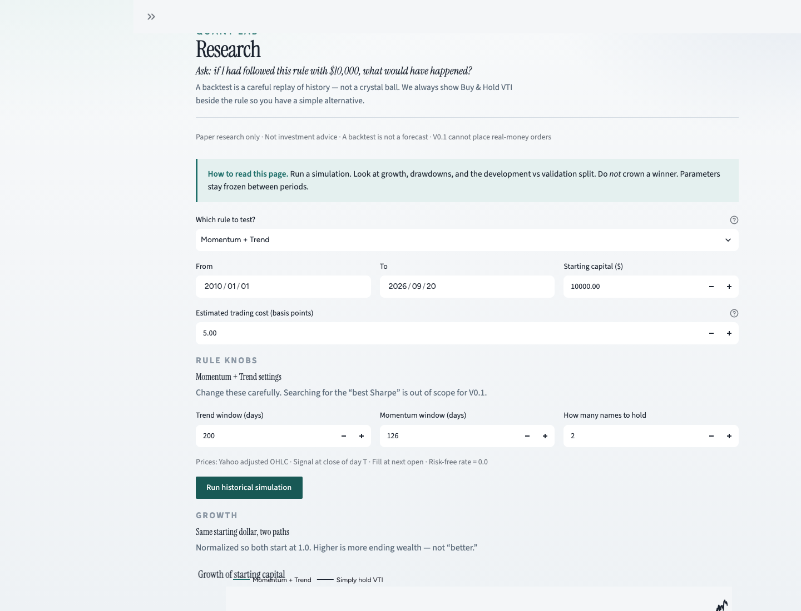

# Website section — Quant Lab

Paste or adapt this block into your personal site (Projects / Work).  
Replace `GITHUB_URL` and `DEMO_URL` after publish.

---

## Short card (grid)

**Quant Lab**  
Personal quantitative research engine — hypothesis → backtest → risk → paper execution.

Python · Pandas · Pydantic · SQLite · Streamlit · pytest  

[GitHub](GITHUB_URL) · [Live demo](DEMO_URL)

---

## Full case study (recommended)

### Quant Lab

**Personal workshop for testing investing rules — before real money is involved.**

I built Quant Lab as a small but serious quantitative system: modular research pipeline, owned daily backtester, risk engine that can override strategies, and a paper broker with persistence. The UI is a thin client; all financial logic lives in a testable Python package.

It is designed so a future live brokerage adapter can plug in **without rewriting** strategies, portfolio construction, or risk.

#### Why it exists

I wanted infrastructure that forces good habits while learning markets: no look-ahead, explicit costs, mandatory comparison to buy-and-hold, and a clear line between a *proposal* and a *trade*.

#### What I built

- **Architecture:** data → features → strategy → construction → risk → broker  
- **Backtester:** signals at close T execute at the next open; covered by synthetic look-ahead tests  
- **Strategies:** Buy & Hold (VTI benchmark) and Momentum + Trend (transparent research rule)  
- **Risk:** exposure caps, cash buffer, per-name limits, no leverage/shorts in V0.1  
- **Paper trading:** $1,000 experimental bankroll, SQLite history  
- **Product:** Streamlit workspace framed as four rooms — look, test, propose, practice  

#### What I did *not* do

- No AI stock picker  
- No automatic parameter optimization  
- No live brokerage or real-money path in V0.1  

#### Stack

Python 3.11+, Pandas, NumPy, SciPy, Pydantic, Plotly, Streamlit, yfinance, SQLite, pytest.

#### Links

- Source: `GITHUB_URL`  
- Demo: `DEMO_URL`  
- Architecture: `GITHUB_URL/blob/main/docs/ARCHITECTURE.md`  
- Case note: `GITHUB_URL/blob/main/docs/CASE_NOTE.md`  

#### Screenshot

#### Disclaimer

Research and paper trading only. Not investment advice. A backtest is not evidence of future profitability.

---

## LinkedIn / bio one-liner

Building Quant Lab — a personal research engine for testing investing rules with risk controls and paper execution (Python).

---

## Interview opener (15 seconds)

> Quant Lab is my owned research stack: strategies emit intent, a risk engine can resize them, and a paper broker executes only after that review. The backtester forbids same-session fills, and I have tests that prove look-ahead can’t sneak in.
